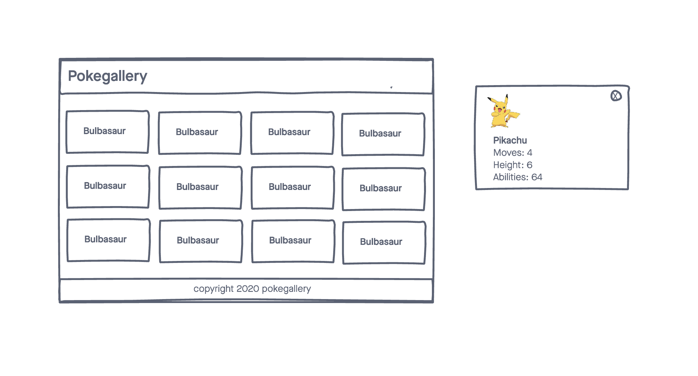

# PokeGallery

A simple web application that displays pokemon data using the pokemon API

## Techonologies Used

-HTML5
-CSS3
-JavaScript
-jQuery
-Google Fonts
-jQuery Model
-Pokemon API

## Screenshots

## Getting Started

[Click Here](https://agoody44.github.io/pokemongallery/) to see the deployed app!

## Future Enchancments
- The abilit to favorite and save pokemon to localstorage